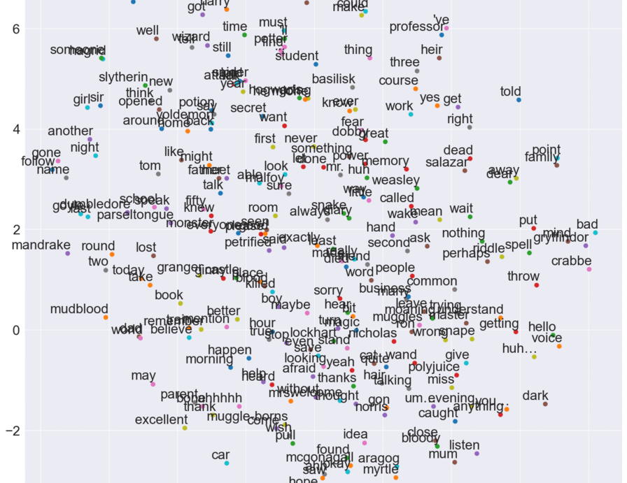

# Word2Vec on Harry Potter - README

## Overview

Welcome to the magical realm of NLP! The "Word2Vec on Harry Potter" project casts a spell on the text of the Harry Potter series to conjure word embeddings that capture the essence of J.K. Rowling's universe. It's a fascinating journey into the world of word vectors, where we unlock relationships and analogies between words through the power of Word2Vec.

## Features

- Training Word2Vec models on the Harry Potter Script.
- Interactive exploration of word relationships and similarities.
- Visualization of word vectors in 2D space.
- A dive into semantic analogies and clusters within the text.

## Motivation

The wizarding world of Harry Potter is rich in context and relationships, making it an ideal dataset to train Word2Vec models. The goal is to understand the intricacies of word embeddings, discover semantic relationships, and gain insights into how characters and themes are interwoven in the narrative.

## How to Use

1. Ensure Python and the necessary libraries (e.g., gensim, matplotlib) are installed.
2. Run the Jupyter notebook to train the Word2Vec model with the Harry Potter [dataset](HarryPotter_2.xlsx).
3. Use the trained model to explore word similarities and relationships.
4. Visualize the word vectors and uncover hidden patterns in the data.

## Dependencies

- Gensim for Word2Vec implementation.
- Matplotlib for visualizing word vectors.
- NLTK for text preprocessing and analysis.

## Inspiration

 I'm just a fan and landed on the script [Harry Potter and the Chamber of Secrets script](https://www.kaggle.com/datasets/eward96/harry-potter-and-the-chamber-of-secrets-script).

